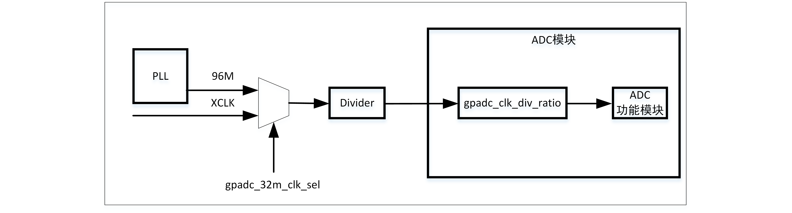

===========
ADC
===========

简介
=====
GLB(Global Register)是芯片通用全局设定模块，主要包含了时钟管理、复位管理、总线管理、内存管理以及GPIO管理等功能。

主要特点
===========

- 高性能

    + 可以选择12-bit, 14-bit, 16-bit转换结果输出
    + ADC转换时间最快0.5us（12-bit转换结果)
    + 支持1.8V,3.3V可选参考电压
    + 支持DMA将转换结果搬运到内存
    + 支持单通道转换和多通道扫描两种模式
    + 支持单端与差分两种输入模式
    + 支持抖动补偿
    + 支持用户自行设定转换结果偏移值

- 模拟通道数

    * 8路外部模拟通道
    * 2路DAC内部通道
    * 1路VBAT通道
    * 1路TSEN通道

功能描述
===========

ADC 引脚和内部信号
--------------------------

.. table:: ADC内部信号

    +----------+-----------------+-----------------------------------------+
    | 内部信号 |    信号类型     |        信号描述                         |
    +==========+=================+=========================================+
    |   VBAT   |     Input       | 从电源引脚分压过来的电压信号            |
    +----------+-----------------+-----------------------------------------+
    |   TSEN   |     Input       | 内部温度传感器输出电压                  |
    +----------+-----------------+-----------------------------------------+
    |   VREF   |     Input       | 内部模拟模块参考电压                    |
    +----------+-----------------+-----------------------------------------+
    | DACOUTA  |     Input       | DAC模块输出                             |
    +----------+-----------------+-----------------------------------------+
    | DACOUTB  |     Input       | DAC模块输出                             |
    +----------+-----------------+-----------------------------------------+

.. table:: ADC外部引脚

    +----------+-----------------+-----------------------------------------+
    | 外部引脚 |    信号类型     |        信号描述                         |
    +==========+=================+=========================================+
    |   VDDA   |     Input       | 模拟模块供电电压正极                    |
    +----------+-----------------+-----------------------------------------+
    |   VSSA   |     Input       | 模拟模块供电地                          |
    +----------+-----------------+-----------------------------------------+
    | ADC_CHX  |     Input       | 模拟输入引脚，总共7路                   |
    +----------+-----------------+-----------------------------------------+

ADC通道
-------------
ADC采样的可以选择的通道包括外部模拟引脚的输入信号和芯片内部可选信号，具体包括：

- ADC CH0
- ADC CH1
- ADC CH2
- ADC CH3
- ADC CH4
- ADC CH5
- ADC CH6
- ADC CH7
- DAC OUTA
- DAC OUTB
- VBAT
- TSEN
- VREF
- GND

需要注意的是，如果选择VBAT或TSEN作为输入待采信号，需要把gpadc_vbat_en或gpadc_ts_en置位。
ADC模块可以支持单端输入或者差分输入，如果是单端输入模式，负极输入通道需要选择GND。

ADC时钟
-------------

ADC模块的工作时钟来源如下图所示。

ADC的时钟源可以选择来自PLL的96M，XTAL或者内部RC32M，时钟源的选择在GLB模块中设定，同时GLB模块也提供了
时钟分频，默认情况下，ADC的时钟源是96M，时钟分频是2，到达ADC模块的时钟是32M。
在ADC模块内部，提供了一个时钟分频，默认16分频，故ADC模块内部的时钟默认是2M。用户可以根据实际采样需求，
自行调整ADC的时钟源和各个分频系数。
gpadc_32m_clk_div分频寄存器宽度为6Bits，最大分频为64，分频公式为fout=fsource/(gpadc_32m_clk_div+1)。
gpadc_clk_div_ratio分频寄存器位于ADC模块内部，宽度为3Bits,其分频值定义如下：

- 3'b000: div=1
- 3'b001: div=4
- 3'b010: div=8
- 3'b011: div=12
- 3'b100: div=16
- 3'b101: div=20
- 3'b110: div=24
- 3'b111: div=32

ADC转换模式
-------------

ADC支持单通道转换和扫描转换两种模式，在单通道转换模式下，用户需要通过gpadc_pos_sel选择正极输入通道，
通过gpadc_neg_sel选择负极输入通道，同时把gpadc_cont_conv_en控制位设置为0，表示单通道转换，
然后设置gpadc_conv_start控制位启动转换即可。

在扫描转换模式下，gpadc_cont_conv_en控制位需要设置为1，ADC根据gpadc_scan_length控制位设定的转换通道个数，
依次按照gpadc_reg_scn_posX(X=1，2）和gpadc_reg_scn_negX(X=1，2）寄存器组所设定的通道顺序，逐个进行转换，
转换的结果会自动推入ADC的FIFO。gpadc_reg_scn_posX(X=1，2）和gpadc_reg_scn_negX(X=1，2）寄存器组所设定的
通道可以相同，这也就意味着用户可以实现对一个通道进行多次采样转换。

ADC的转换结果一般都是放入FIFO中，ADC模块不提供转换完成中断，用户需要根据实际转换通道数，设定FIFO接收数据阈值中断，
通过FIFO的阈值中断，作为ADC转换完成中断。

ADC结果
-------------
gpadc_raw_data寄存器存放了ADC的原始结果，在单端模式下，数据有效位是12Bits，无符号位，在差分模式下，最高位为符号位，
剩下11Bits代表转换的结果。

gpadc_data_out寄存器存放了ADC的结果，这个结果里包含了ADC结果，符号位和通道信息，数据格式如下：

.. table:: ADC转换结果含义

    +-------+--+--+--+--+--+--+--+--+--+--+--+--+--+--+--+--+--+--+--+--+--+--+--+--+--+--+
    | BitS  |25|24|23|22|21|20|19|18|17|16|15|14|13|12|11|10|9 | 8| 7| 6| 5| 4| 3| 2| 1| 0|
    +=======+==+==+==+==+==+==+==+==+==+==+==+==+==+==+==+==+==+==+==+==+==+==+==+==+==+==+
    | 含义  |  正极通道号  |  负极通道号  |                    转换结果                   |
    +-------+--------------+--------------+-----------------------------------------------+

转换结果的Bit21-BitS25是正极通道号，Bit16-Bit20是负极通道号，Bit0-Bit15是转换的数值。

gpadc_res_sel控制位可以设定转换结果的位数为12位，14位，和16位，其中14位和16位是多次采样提高精度得到的结果，
其可以设置的值如下：

- 3'b000    12bit 2MS/s, OSR=1 
- 3'b001    14bit 125kS/s, OSR=16
- 3'b010    14bit 31.25kS/s, OSR=64 
- 3'b011    16bit 15.625KS/s, OSR=128
- 3'b100    16bit 7.8125KS/s, OSR=256

当选择12位时，转换结果的Bit0-Bit11有效，当选择14位时，转换结果的Bit0-Bit13有效，当选择16位时，转换结果的Bit0-Bit15有效。
同样，在差分模式下，最高为是符号为，也就是，当选择14位时，Bit13是符号位，Bit0-Bit12是转换结果。

在实际使用中，ADC的结果一般都是放入FIFO，这在多通道扫描模式下尤为重要，所以用户一般都是从ADC FIFO获取转换结果，
ADC FIFO的数据格式gpadc_data_out寄存器中数据格式相同。

ADC中断
-------------
ADC模块在正极采样饱和和负极采样饱和时可以产生中断，可以通过gpadc_pos_satur_mask，gpadc_neg_satur_mask屏蔽各自中断，
当中断产生时，可以通过gpadc_pos_satur，和gpadc_neg_satur寄存器查询中断状态，同时可以通过gpadc_pos_satur_clr和gpadc_neg_satur_clr清除中断。该功能可以用来判断输入电压是否异常。

ADC FIFO
-------------

ADC模块拥有深度为32的FIFO，数据宽度为26Bits，当ADC完成转换后，会自动将结果推入到FIFO。ADC的FIFO有如下状态和中断管理功能：
- FIFO满状态
- FIFO非空状态
- FIFO Overrun中断
- FIFO Underrun中断

当中断产生时，可以通过对应的clear位将中断标志清除掉。

利用ADC的FIFO用户可以实现三种模式获取数据：查询模式，中断模式，DMA模式

**查询模式**

CPU轮询gpadc_rdy位，当该控制位置位时，说明FIFO中存在有效数据，CPU可以根据gpadc_fifo_data_count获知
FIFO数据个数并从FIFO读出这些数据。

**中断模式**

CPU设置gpadc_rdy_mask为0，ADC就会在FIFO有数据推入的时候产生中断，用户可在中断函数中，根据gpadc_fifo_data_count获知
FIFO数据个数并从FIFO读出这些数据，然后设置gpadc_rdy_clr清除中断。

**DMA模式**

用户设定gpadc_dma_en控制位，可以配合DMA完成转换数据到内存的搬运，在使用DMA模式时，通过gpadc_fifo_thl设置ADC FIFO发送
DMA请求的数据个数阈值，DMA在收到请求时，会自动根据用户设定的参数，从FIFO搬运指定个数的结果到对应的内存。

ADC设置流程
-------------

**设置ADC时钟**

根据ADC转换速度需求，确定ADC的工作时钟，设定GLB模块的ADC时钟源和分频，结合gpadc_clk_div_ratio，确定最终ADC模块的工作时钟频率。

**根据使用的通道设置GPIO**

根据使用的模拟引脚，确定使用的通道号，初始化对应的GPIO为模拟功能，需要注意的是，在设定GPIO为模拟输入的时候，不要设置GPIO的上拉
或者下拉，需要设置为浮空输入。

**设定要转换的通道**

根据使用的模拟通道和转换模式，设定对应的通道寄存器，对于单通道转换，在gpadc_pos_sel和gpadc_neg_sel寄存器中设置转换的通道信息。
对于多通道扫描模式，根据要扫描通道数目和扫描顺序，设定gpadc_scan_length,gpadc_reg_scn_posX和gpadc_reg_scn_negX。

**设定数据读取方式**

根据ADC FIFO介绍的读取数据方式，选择使用的模式，设置对应的寄存器。如果使用DMA，同样需要配置DMA的一个通道，配合ADC FIFO完成数据的搬运。

**启动转换**

最后设置gpadc_res_sel选择数据转换结果的精度，最后设置gpadc_global_en=1，gpadc_conv_start=1就可以启动ADC开始转换。
当转换完成，需要再次转换时，需要将gpadc_conv_start设置为0，再设置为1，以便再次触发转换。

