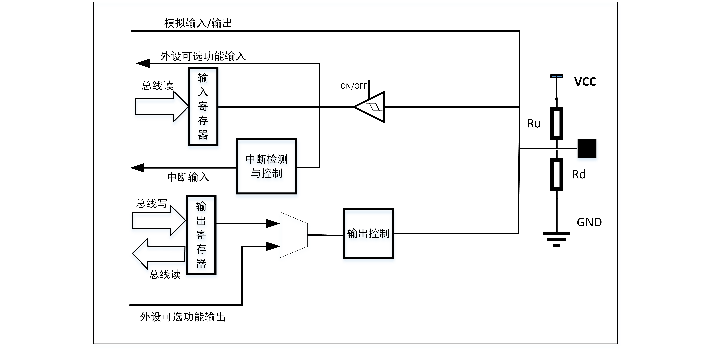

===========
GLB
===========

简介
=====
GLB(Global Register)是芯片通用全局设定模块，主要包含了时钟管理、复位管理、总线管理、内存管理以及GPIO管理等功能。

功能描述
===========
时钟管理
-------------
时钟管理功能主要用于设定处理器、总线、各个外设的时钟，通过该模块可以设定上述模块工作的时钟源，时钟分频等，同时也可以实现对上述模块时钟的门控，以达到系统低功耗的目的。
详细设定可以参考系统时钟相关的章节。

复位管理
-------------
提供各个外设模块的单独复位功能以及芯片复位功能。芯片复位包括：

- CPU复位：仅仅复位CPU模块，程序会重新运行，外设不会被复位

- 系统复位：各个外设和CPU会被复位，但是AON域的相关寄存器不会被复位

- 上电复位：整个系统包括AON域的相关寄存器都会被复位

应用程序可以根据需要，选择使用对应的复位方式。

总线管理
-------------
提供总线的仲裁设定以及总线出错设定，可以设定在总线出错时候是否产生中断，并提供出错总线地址信息，方便用户调试程序。

内存管理
-------------
提供各个内存模块在芯片系统低功耗模式时的功耗管理，包含两种设定模式：

- retention模式：在该模式下，内存上的数据可以保存，但是在退出低功耗模式之前，无法读写。
- sleep模式：在该模式下，内存的数据会丢失，仅用于降低系统功耗。

GPIO管理
-------------

GPIO概述
-------------
GPIO管理功能提供GPIO控制寄存器，实现软件对 GPIO 属性的配置，使用户能够方便的操作 GPIO。每个GPIO可以配置为输入、输出和可选功能三种模式。在每个模式下(除模拟可选功能)，提供设置上拉，下拉，浮空三种端口状态，此外GPIO还提供中断功能，可以配置为上升沿触发，下降沿触发或者边沿触发。

GPIO主要特点
-------------

- 可以配置为普通输入输出功能，该模式下可以设定上拉，下拉或者浮空输入输出。
- 可以配置为可选功能，搭配外设功能使用，该模式下亦可以设定上拉，下拉，在使用模拟功能时，必须设置为浮空。
- 可以设置驱动能力，以提供更大的输出电流。
- 可以设置施密特触发器功能，提供简单硬件防抖功能。

GPIO功能描述
-------------
每个GPIO可以通过软件配置为：

- 浮空输入
- 上拉输入
- 下拉输入
- 上拉中断输入
- 下拉中断输入
- 浮空中断输入
- 上拉输出
- 下拉输出
- 浮空输出
- 模拟输入可选功能
- 模拟输出可选功能
- 数字可选功能

GPIO模块基本框图如图所示。

GPIO功能设定
-------------

GPIO的功能通过GPIO_CFGCTL寄存器组设定，主要设定项包括：

- func_sel：选择GPIO功能
- pu：选择是否上拉
- pd：选择是否下拉
- drv：设定驱动能力
- smt：选择是否使能施密特触发器
- ie：设定输入使能
- oe：设定输出使能

GPIO可以设定的功能包括：

- Flash/QSPI：设定GPIO为QSPI功能，可以连接Flash，作为程序存储/运行介质
- SPI：设定GPIO为SPI功能
- I2C：设定GPIO为I2C功能
- UART：设定GPIO为UART功能
- PWM：设定GPIO为PWM功能
- ANA：设定GPIO为Analog功能
- SWGPIO：设定GPIO为通用IO功能
- JTAG：设定GPIO为JTAG功能

为了尽可能最大限度的满足客户需求，每个GPIO基本上都可以选择上述可选功能，当选择某个可选功能时，GPIO与对应的功能信号如下表所示：

.. table:: GPIO功能表 

    +--------+------------+------------+------------+------------+------------+------------+-------------+------------+------------+
    | GPIO   |    SDIO    |    FLASH   |    SPI     |    I2C     |    UART    |    PWM     |    Analog   |    SWGPIO  |    JTAG    |
    +========+============+============+============+============+============+============+=============+============+============+
    | GPIO0  | SDIO_CLK   | SF_D1      | SPI_MISO   | I2C_SCL    | UART_SIG0  | PWM_CH0    |             | SWGPIO0    | E21_TMS    |
    +--------+------------+------------+------------+------------+------------+------------+-------------+------------+------------+
    | GPIO1  | SDIO_CMD   | SF_D2      | SPI_MOSI   | I2C_SDA    | UART_SIG1  | PWM_CH1    |             | SWGPIO1    | E21_TDI    |
    +--------+------------+------------+------------+------------+------------+------------+-------------+------------+------------+
    | GPIO2  | SDIO_DAT0  | SF_D2      | SPI_SS     | I2C_SCL    | UART_SIG2  | PWM_CH2    |             | SWGPIO2    | E21_TCK    |
    +--------+------------+------------+------------+------------+------------+------------+-------------+------------+------------+
    | GPIO3  | SDIO_DAT1  | SF_D3      | SPI_SCLK   | I2C_SDA    | UART_SIG3  | PWM_CH3    |             | SWGPIO3    | E21_TDO    |
    +--------+------------+------------+------------+------------+------------+------------+-------------+------------+------------+
    | GPIO4  | SDIO_DAT2  |            | SPI_MISO   | I2C_SCL    | UART_SIG4  | PWM_CH4    |   CH1       | SWGPIO4    | E21_TMS    |
    +--------+------------+------------+------------+------------+------------+------------+-------------+------------+------------+
    | GPIO5  | SDIO_DAT3  |            | SPI_MOSI   | I2C_SDA    | UART_SIG5  | PWM_CH0    |   CH4       | SWGPIO5    | E21_TDI    |
    +--------+------------+------------+------------+------------+------------+------------+-------------+------------+------------+
    | GPIO6  |            |            | SPI_SS     | I2C_SCL    | UART_SIG6  | PWM_CH1    |   CH5       | SWGPIO6    | E21_TCK    |
    +--------+------------+------------+------------+------------+------------+------------+-------------+------------+------------+
    | GPIO7  |            |            | SPI_SCLK   | I2C_SDA    | UART_SIG7  | PWM_CH2    |             | SWGPIO7    | E21_TDO    |
    +--------+------------+------------+------------+------------+------------+------------+-------------+------------+------------+
    | GPIO8  |            |            | SPI_MISO   | I2C_SCL    | UART_SIG0  | PWM_CH3    |             | SWGPIO8    | E21_TMS    |
    +--------+------------+------------+------------+------------+------------+------------+-------------+------------+------------+
    | GPIO9  |            |            | SPI_MOSI   | I2C_SDA    | UART_SIG1  | PWM_CH4    |  CH6/7      | SWGPIO9    | E21_TDI    |
    +--------+------------+------------+------------+------------+------------+------------+-------------+------------+------------+
    | GPIO10 |            |            | SPI_SS     | I2C_SCL    | UART_SIG2  | PWM_CH0    |MICBIAS/CH8/9| SWGPIO10   | E21_TCK    |
    +--------+------------+------------+------------+------------+------------+------------+-------------+------------+------------+
    | GPIO11 |            |            | SPI_SCLK   | I2C_SDA    | UART_SIG3  | PWM_CH1    |IROUT/CH10   | SWGPIO11   | E21_TDO    |
    +--------+------------+------------+------------+------------+------------+------------+-------------+------------+------------+
    | GPIO12 |            |            | SPI_MISO   | I2C_SCL    | UART_SIG4  | PWM_CH2    |ADC_VREF/CH0 | SWGPIO12   | E21_TMS    |
    +--------+------------+------------+------------+------------+------------+------------+-------------+------------+------------+
    | GPIO13 |            |            | SPI_MOSI   | I2C_SDA    | UART_SIG5  | PWM_CH3    |    CH3      | SWGPIO13   | E21_TDI    |
    +--------+------------+------------+------------+------------+------------+------------+-------------+------------+------------+
    | GPIO14 |            |            | SPI_SS     | I2C_SCL    | UART_SIG6  | PWM_CH4    |    CH2      | SWGPIO14   | E21_TCK    |
    +--------+------------+------------+------------+------------+------------+------------+-------------+------------+------------+
    | GPIO15 |            |            | SPI_SCLK   | I2C_SDA    | UART_SIG7  | PWM_CH0    |PSWIROUT/CH11| SWGPIO15   | E21_TDO    |
    +--------+------------+------------+------------+------------+------------+------------+-------------+------------+------------+
    | GPIO16 |            |            | SPI_MISO   | I2C_SCL    | UART_SIG0  | PWM_CH1    |             | SWGPIO16   | E21_TMS    |
    +--------+------------+------------+------------+------------+------------+------------+-------------+------------+------------+
    | GPIO17 |            | SF_D3      | SPI_MOSI   | I2C_SDA    | UART_SIG1  | PWM_CH2    |DC_TP_OUT    | SWGPIO17   | E21_TDI    |
    +--------+------------+------------+------------+------------+------------+------------+-------------+------------+------------+
    | GPIO18 |            | SF_D2      | SPI_SS     | I2C_SCL    | UART_SIG2  | PWM_CH3    |             | SWGPIO18   | E21_TCK    |
    +--------+------------+------------+------------+------------+------------+------------+-------------+------------+------------+
    | GPIO19 |            | SF_D1      | SPI_SCLK   | I2C_SDA    | UART_SIG3  | PWM_CH4    |             | SWGPIO19   | E21_TDO    |
    +--------+------------+------------+------------+------------+------------+------------+-------------+------------+------------+
    | GPIO20 |            | SF_D0      | SPI_MISO   | I2C_SCL    | UART_SIG4  | PWM_CH0    |             | SWGPIO20   | E21_TMS    |
    +--------+------------+------------+------------+------------+------------+------------+-------------+------------+------------+
    | GPIO21 |            | SF_CS      | SPI_MOSI   | I2C_SDA    | UART_SIG5  | PWM_CH1    |             | SWGPIO21   | E21_TDI    |
    +--------+------------+------------+------------+------------+------------+------------+-------------+------------+------------+
    | GPIO22 |            | SF_CLK_OUT | SPI_SS     | I2C_SCL    | UART_SIG6  | PWM_CH2    |             | SWGPIO22   | E21_TCK    |
    +--------+------------+------------+------------+------------+------------+------------+-------------+------------+------------+

在上述表格中，当选择UART功能时，只是选择了UART的一个信号，并没有指定该引脚的具体功能（比如是UART TX还是UART RX),还需要通过UART_SIGX_SEL(X=0-7)进一步选择具体的UART信号及对应的功能。
每一个UART_SIGX_SEL可以选择的信号包括：

- 0 : UART0_RTS
- 1 : UART0_CTS
- 2 : UART0_TXD
- 3 : UART0_RXD
- 4 : UART1_RTS
- 5 : UART1_CTS
- 6 : UART1_TXD
- 7 : UART1_RXD

以GPIO0为例，当fun_sel选择UART的时候，GPIO0选择的是UART_SIG0,在默认情况下UART_SIG0_SEL的值是0，也就是UART0_RTS，即GPIO是UART0_RTS功能。如果应用程序想把GPIO作为UART1_TXD,那只要把UART_SIG0_SEL设置为6,
那么GPIO0的功能就是UART1_TXD。

GPIO输出设置
-------------

通过设定func_sel为SWGPIO，GPIO可以作为普通GPIO的输入/输出，将ie设置为0，oe设置为1，就可以将GPIO配置为输出功能，输出的数值通过GPIO_O寄存器组设定。
当GPIO_O对应Bit设置为0时，GPIO输出低电平，当GPIO_O对应Bit设置为1时，GPIO输出高电平。可以通过drv控制位设置输出能力。

GPIO输入设置
-------------

通过设定func_sel为SWGPIO，将ie设置为1，oe设置为0，就可以将GPIO配置为输入功能，可以通过smt控制位设置是否使能施密特触发器，通过pd，pu控制位设置上拉下拉属性。
外部输入的数值，可以通过读取GPIO_I寄存器对应的Bit获取到。

GPIO可选功能设置
----------------

通过设定func_sel为对应的外设功能，可以实现GPIO与外设的连接，实现外设的输入输出，从GPIO的基础功能框图可以看出，当选择可选功能时，需要将ie设置为1，oe设置为0，也就是断开普通GPIO的输出控制功能。
这样，对于固定输入功能的外设，外设的OE信号始终为0，从而实现输入功能；对于固定输出的外设，其OE信号始终为1，从而实现输出是被外设控制，而此时的输入信号就是输出信号，
但是不会被正在输出的外设采集；当外设既需要输入又要输出时，通过控制外设OE信号就可以实现输入输出。

GPIO中断设置
-------------

要使用GPIO的中断功能，需要先将GPIO设置为输入模式，中断触发模式通过GPIO_INT_MODE_SET寄存器组进行设定。可以设定的中断模式包括：

- 上升沿触发中断
- 下降沿触发中断
- 电平触发中断

每个GPIO都可以设定为中断功能，是否使能某个GPIO中断可以通过GPIO_INT_MASK寄存器进行设定，中断产生时，在中断函数中可以通过GPIO_INT_STAT寄存器获取到产生中断的GPIO引脚号，同时可以通过GPIO_INT_CLR清除掉对应的中断信号。

